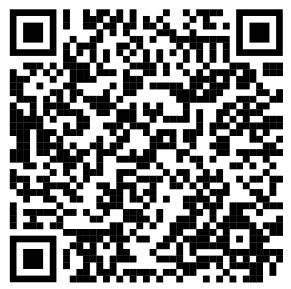

# My Medicines 💊

A web-based medication reminder tool built for people with learning difficulties.

## Try it live

Scan the QR code or open the link on any phone or computer — no installation needed.

---

## Background

This tool was created as part of a hackathon at the [Digital Health and AI Conference 2026](https://www.kingsfund.org.uk/events/digital-health-ai-conference-2026), organised by **The King's Fund**.

It is a collaboration between:

- **[CCI — Creative Computing Institute](https://www.arts.ac.uk/creative-computing-institute)**, University of the Arts London — providing the technical development
- **[Heart n Soul](https://www.heartnsoul.co.uk)** — a creative arts charity led by and for people with learning disabilities, providing lived experience and user insight

The hackathon ran for one hour and brought together:
- 1 CCI team member (technical lead, building the tool through AI-assisted / vibe coding)
- 1 Heart n Soul participant as the primary user, whose needs and feedback shaped the tool in real time
- Several other participants who tested the tool and gave feedback

The goal was to explore a simple question: **can AI tools help create practical, accessible daily tools for people with learning difficulties — quickly, and with the people who will actually use them?**

---

## What this tool does

**My Medicines** is a friendly, inclusive medication reminder app that helps people keep track of what medicine to take, when to take it, and how.

It is designed to be simple and accessible for people with learning difficulties, with features including:

- **Multiple ways to add a medicine** — type it in, use an AI chatbot, take a photo of a prescription (with automatic text recognition), or scan a barcode
- **Voice input and read-aloud** — speak your answers to the chatbot, and have the page read back to you using text-to-speech
- **Spell checking** — automatically catches likely typos in medicine names and doses and asks you to confirm
- **Schedule view** — see your medicines in a list or weekly calendar, and adjust the times you take them
- **Duration tracking** — set how many days a course of medicine lasts; it disappears from your plan automatically when the course ends
- **My Plan** — a daily, weekly, and monthly overview of all your medicines at a glance, with colour-coded dots for each medicine
- **Reminders** — set phone notifications, alarms, calendar events, or ask the app to tell your contacts
- **No account or internet required** — runs entirely in the browser, nothing is sent to a server

---

## Technical notes

- Single-file static web app (`index.html`) — no build step, no backend, no dependencies to install
- AI chatbot and voice input use the browser's built-in Web Speech API
- Photo OCR uses [Tesseract.js](https://github.com/naptha/tesseract.js) (in-browser, no data leaves the device)
- Built with AI-assisted coding (Claude) during the hackathon session
